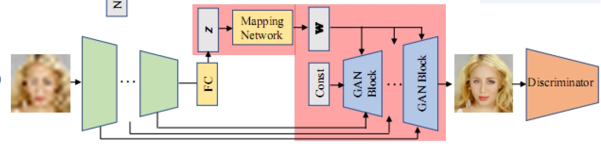
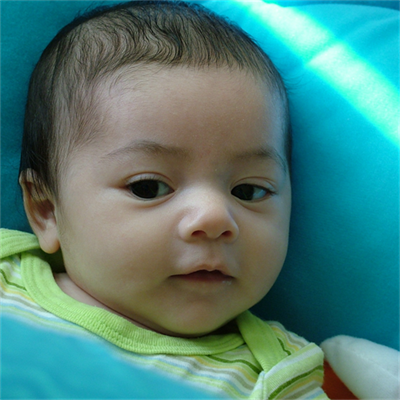

[English]() | 中文

## GPEN 盲人脸修复模型

## 目录
[TOC]


## 1、简介

该模型是一个盲人脸修复模型。作者将前人提出的 StyleGAN V2 的解码器嵌入模型，作为GPEN的解码器；用DNN重新构建了一种简单的编码器，为解码器提供输入。这样模型在保留了 StyleGAN V2 解码器优秀的性能的基础上，将模型的功能由图像风格转换变为了盲人脸修复。模型的总体结构如下图所示：



该模型的总体结构如上图所示。左边的区域为生成器（Generator）的结构，绿色部分为编码器，中间的Mapping Network用于特征映射，这两部分为作者添加的结构。蓝色的部分为解码器，const为作者添加的噪声输入。最右侧的为对抗网络的鉴别器。其中解码器、鉴别器的结构与StyleGAN V2一致。


本项目也集成到了百度飞浆AI Studio中，可更快进行复现。

地址：https://aistudio.baidu.com/aistudio/projectdetail/3936241?contributionType=1


## 2、准备工作

### 2.1 数据集准备

GPEN模型训练集是经典的FFHQ人脸数据集,共70000张1024 x 1024高分辨率的清晰人脸图片，测试集是CELEBA-HQ数据集，共2000张高分辨率人脸图片。详细信息可以参考**数据集网址:** [FFHQ](https://github.com/NVlabs/ffhq-dataset) ，[CELEBA-HQ](https://github.com/tkarras/progressive_growing_of_gans) 。以下给出了具体的下载链接：

**数据集下载地址：**

**FFHQ ：**           https://drive.google.com/drive/folders/1tZUcXDBeOibC6jcMCtgRRz67pzrAHeHL?usp=drive_open

**CELEBA-HQ：** https://drive.google.com/drive/folders/0B4qLcYyJmiz0TXY1NG02bzZVRGs?resourcekey=0-arAVTUfW9KRhN-irJchVKQ&usp=sharing


**下载后，文件组织形式如下**

```
|-- data/GPEN
	|-- train
		|-- 00000
			|-- 00000.png
			|-- 00001.png
			|-- ......
			|-- 00999.png
		|-- 01000
			|-- ......
		|-- ......
		|-- 69000
            |-- ......
                |-- 69999.png
	|-- test
		|-- 2000张png图片
```


### 2.2 模型准备

**模型参数文件及训练日志下载地址：**

链接：   提取码：

从链接中下载模型参数,并放到项目根目录下的data文件夹下，这样data下有个GPEN文件夹，FFA文件夹下包含四个模型参数文件以及一个参考训练日志文件，具体文件结构如下所示：

**文件结构**


```
  data/GPEN
        |-- model_ir_se50_2.pdparams  #复现的模型经过400000step训练后得到的室内去雾模型的参数文件
        |-- G_256_repo.pdparams       #复现的256分辨率生成器的的模型参数文件
        |-- D_256_repo.pdparams       #复现的256分辨率鉴别器的的模型参数文件
        |-- G_256_article_pretrained.pdparams   #作者提供的256分辨率的生成器的模型参数文件
        |-- train.log                          #完整的训练日志文件
```

注：由于paddle.grad存在问题，还未进行完整的训练过程，以下提供一个[临时链接](https://bj.bcebos.com/v1/ai-studio-online/aac46cbb3bba4fa183c652bf8b6822a29991c40886fe42d88af91567a375142f?responseContentDisposition=attachment%3B%20filename%3DG_256_weight_best.pdparams&authorization=bce-auth-v1%2F0ef6765c1e494918bc0d4c3ca3e5c6d1%2F2022-04-29T04%3A46%3A27Z%2F-1%2F%2F46f8663a86719254876bd7dd12ce727ec33058d66af4faac2f131c53a87d6129)，

链接中的模型参数文件与G_256_article_pretrained.pdparams相同，可更名后进行测试。

### 

经过测试，训练512 x 512分辨率的模型所需的时间是256 x 256分辨率模型的三倍，因此在这里我只复现了256 x 256 分辨率的GPEN模型，来验证复现的效果。当然该项目也支持复现512分辨率的模型，只需修改配置文件中模型的size参数为512即可。256分辨率模型的复现精度对比如下表所示：

**CELE数据集测试精度(256 x 256 分辨率)：**

| Backbone | Train dataset | Test dataset | FID    | PSNR  | checkpoints                       |
| -------- | ------------- | ------------ | ------ | ----- | --------------------------------- |
| GPEN     | FFHQ          | CELEBA-HQ    | 123.48 | 21.85 | G_256_article_pretrained.pdparams |
| GPEN     | FFHQ          | CELEBA-HQ    |        |       | G_256_repo.pdparams               |

注：在这里前者为作者提供的模型的测试精度。后者为用本项目从零训练的复现模型的测试精度。


## 3、开始使用

### 3.1 模型训练

在控制台输入以下代码，开始训练：

 ```shell
 python train.py --size=256 --mul=1 --narrow=0.5 --start_iter=0  --max_iter=15000 --batch_size=2 --pretrain=None --train_path='data/GPEN/train/'   --test_path='data/GPEN/test/'
 ```

训练过程中会在ckpts/文件夹下生成train.log文件夹，用于保存训练日志。

如果你想要在其他数据集上训练网络，在 configs/GPEN.yaml 中修改数据集的路径。

如果要修改模型的参数，可修改的参数主要是size、mul和narrow，决定了模型针对的图片的分辨率，推荐选用256或512。如果要将size改为512，则要同时将mul改为2、narrow改为1，下面的操作步骤也是这样。

如果要改变训练的step数，需要修改max_iter 参数。

如果要从训练断点继续训练，则修改pretrain参数为模型参数文件位置，并根据需要修改start_iter来保证训练日志的延续性。


### 3.2 模型评估

对模型进行评估时，在控制台输入以下代码，下面代码中使用上面提到的下载的模型参数：

 ```shell
 ###对作者提供的模型进行评估###
 python test.py -w data/GPEN/G_256_article_pretrained.pdparams --test_path='data/GPEN/test/' --size=256  --mul=1 --narrow=0.5

 ###对我复现的模型进行评估###
 python test.py -w data/GPEN/G_256_repo.pdparams --test_path='data/GPEN/test/' --size=256  --mul=1 --narrow=0.5
 ```

如果要测试你自己准备的图像，请更改test_path参数。

如果要在自己提供的模型上进行测试，请将模型的路径放在 -w 后面。


### 3.3 模型单图像测试

对模型进行单图像的简单测试时，在控制台输入以下代码，下面代码中使用上面提到的下载的模型参数：

 ```shell
 ###对作者提供的模型进行测试###
 python predict.py --size 256  --mul=1 --narrow=0.5 --w data/GPEN/G_256_article_pretrained.pdparams --img data/GPEN/predict/test_img.jpg

 ###对我复现的模型进行测试###
 python predict.py --size 256  --mul=1 --narrow=0.5 --w data/GPEN/G_256_repo.pdparams --img data/GPEN/predict/test_img.jpg
 ```

如果要在自己提供的模型上进行测试，请将模型的路径放在 -w 后面。如要修改测试的图片，请修改--img后的模型参数。


## 4. Tipc

### 4.1 导出inference模型

```bash
python export_model.py --model_path data/GPEN/G_256_repo.pdparams  --save_dir inference/GPEN
```

上述命令将生成预测所需的模型结构文件`model.pdmodel`和模型权重文件`model.pdiparams`以及`model.pdiparams.info`文件，均存放在`inference/GPEN/`目录下。


### 4.2 使用预测引擎推理

```bash
python infer.py --model_file inference/GPEN/model.pdmodel --params_file inference/GPEN/model.pdiparams --img data/GPEN/predict/test_img.jpg
```

推理结束会默认保存下模型生成的修复图像，并输出测试得到的FID和psnr值。

以下是样例图片和对应的修复图像：

<p align='center'>



输出示例如下:

```
result saved in : data/GPEN/predict/test_img_predict.png
	FID: 151.78178552134233
	PSNR:21.65281356833421
```

注：由于对高清图片进行退化的操作具有一定的随机性，所以每次测试的结果都会有所不同。为了保证测试结果一致，在这里我固定了随机种子，使每次测试时对图片都进行相同的退化操作。


### 4.3 调用脚本两步完成训推一体测试

测试基本训练预测功能的`lite_train_lite_infer`模式，运行：

```shell
# 准备数据
bash test_tipc/prepare.sh ./test_tipc/configs/GPEN/train_infer_python.txt 'lite_train_lite_infer'
# 运行测试
bash test_tipc/test_train_inference_python.sh ./test_tipc/configs/GPEN/train_infer_python.txt 'lite_train_lite_infer'
```


## 5. 代码结构说明


```
GPEN/ 
  	|-- data/         #存放数据集及下载的模型参数文件的文件夹
    |-- data_loader/  #存放数据预处理相关的代码
    |-- model/        #存放GPEN模型结构相关的代码
    |-- loss/         #存放损失函数计算相关的代码
    |-- metric/       #存放计算评估指标(FID,PSNR)相关的代码
    |-- test_tipc/    #存放tipc相关文件
    |-- figs/         #存放说明文档用到的图片
    |-- ckpts/        #训练时生成的文件夹，用于存放训练过程中保存的模型参数
    |-- samples/      #训练时生成的文件夹，用于存放训练过程中保存的测试图片，来直观地展示训练过程中模型生成图片的变化
    |-- train.py           #模型训练时调用
    |-- test.py            #模型评估时调用
    |-- predict.py         #用模型测试单张图片时调用
    |-- export_model.py    #tipc生成推理模型时调用
    |-- infer.py           #tipc进行推理时调用
    |-- readme.md          #项目说明文档
```


## 6. LICENSE

本项目的发布受[Apache 2.0 license](https://github.com/PaddlePaddle/models/blob/release/2.2/community/repo_template/LICENSE)许可认证。


## 7、参考文献与链接

论文地址：https://paperswithcode.com/paper/gan-prior-embedded-network-for-blind-face

参考repo Github：https://github.com/yangxy/GPEN

论文复现指南-CV方向：https://github.com/PaddlePaddle/models/blob/release%2F2.2/tutorials/article-implementation/ArticleReproduction_CV.md

readme文档模板：https://github.com/PaddlePaddle/models/blob/release/2.2/community/repo_template/README.md
